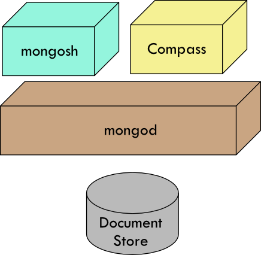

# MongoDB Script Files

<!--TOC_START-->
## Contents
- [MongoDB Inroduction](../../README.md)
- [MongoDB Shell Commands](#mongodb-shell-commands)
  - [Contents](#contents)
  - [Overview](#overview)
  - [What is a MongoDB Script File](#what-is-the-mongo-script-files)
  - [JavaScript File](#javascript-file)
  - [Example Script File](#example-script-file)
  - [Loading the script](#loading-the-script)
  - [Exercise](#exercise)
  - [Script Files and Context](#script-files-and-context)
  - [Using Functions in your Scripts](#using-functions-in-your-scripts)
    - [Managing a database](#managing-a-database)
    - [Counting items in a Collection](#counting-items-in-a-collection)
    - [Listing alphabetically the functions we have created](#listing-alphabetically-the-functions-we-have-created)
  

<!--TOC_END-->
## Overview
This module covers working with MongoDB script files

## What is the Mongo Script Files
In the previous module you worked with Mongo Shell Commands.  You saw that you could use the shell to enter mongo CRUD commands and work with the Aggregate operators.  But as you may have discovered the shell is great for helping you write the commands but it's not great for keeping them persistent.

MongoDB supports script files where you can write your command shell commands, create aggregate pipelines, and functions that can be called form the shell.

.  Visit [MongoDB Script Files](https://www.mongodb.com/docs/mongodb-shell/write-scripts/) for further details.

---
**Before executing any commands in the shell, be sure you have selected the database you want to work with, the default is test**

---


## JavaScript File
A MongoDB Script is simply a JavaScript file with JavaScriptand more (MongoDB operations) statements in it.  

You can use variables, control statements, and functions int he scripts.  Any IO calls are ignored unless the result is returned from the function.  So why would you use a script file?  To perform repetitive data transformations tasks that you might have been performing from the shell.  To create seed data for Documents.  To transform Documents; it should be noted that the Aggregation operators are quite extensive and powerful, and they should be adequate for most data transformation needs.

You might still be asking yourself, why can't you perform any IO from the scripts?  That's not their purpose.  Their purpose is described in the paragraph above.

A better way to understand why there is no IO is to look at the relationship between the mongod (the daemon that handles all the DB access) and CLI tools of which mongosh (the shell) is one, and Compass is another. 



The purpose of the shell is to interact with the daemon (mongod).  You have environments such JRM, NodeJS, Python runtime that can be used to interact with the daemon and display results.  MongoDB scripts were not created to replace these other environments.

### Example script file
Here is a script containing one of the aggregate shell commands we ran earlier
[aggregate_project](aggregate_project.js)


## Loading the script
A script is loaded into the shell using the following command
```javascript
load(<path to script>)
```
The script path can relative or absolute.

A relative path is relative to the location where you launched the MongoDb shell from.

So to load the script above, you can type
```javascript
load("aggregate_project.js")
```
OR
```javascript
load("C:\work\MarkDown Files\mongodb\modules\script_files\aggregate_project.js")
```

When a script is loaded, any statements within it are executed.  All IO is suppressed.  If the script was loaded successfully, the shell will report a true, otherwise it reports a false.

## Exercise
Move the shell scripts that you wrote earlier into script files.  Test that they still yeiled the same results as before.

## Script Files and Context
When you load a script, the database that you currently have selected is the context into which the script content is loaded.  Let's walk through an example

1. using Compass, open up the sampleData collection in the demo database.  Empty it of all it's documents
2. Open the shell and create a new database called contexts
   ```javascript
   use contexts
   ```
3. load the aggregate_projects script file
   ```javascipt
   load("aggregate_project.js")
   ```
4. Goto Compass, refresh the list of databases, you should find that contexts is not listed, and under the **demo** database, the collection called ***sampleData*** is still empty

The collection is empty because the projection failed.  The following script
```javascript
db.sampleData.aggregate(
    [
        {$project: {"Items Sold":1}},
        {$out: {db: "demo", coll:"sampleData"}}
    ])
```
looked for a collection called sampleData within the current context (the database we created called **contexts**)

5. In the shell switch to the cooker database
6. load the same script **aggregate_projects.js** again
7. In Compass refresh the database list and check the demo database, sampleData collection, you should now see that it has some data in it

This problem is eaisly fixed by modifying the script to the following content
```javascript
// Connect to a database directly
db = connect( "mongodb://localhost/cooker")

db.sampleData.aggregate(
    [
        {$project: {"Items Sold":1}},
        {$out: {db: "demo", coll:"sampleData"}}
    ])
```
The file line ```db = connect( "mongodb://localhost/cooker")``` switches you to the correct database context before any other script commands are executed

9. Using Compass, open up the sampleData collection in the demo database.  Empty it of all it's documents
10. Open the shell and switch back to database called contexts
   ```javascript
   use contexts
   ```
11. load the aggregate_projects script file
   ```javascipt
   load("db_connect_aggregate_project.js")
   ```
12. Goto Compass, refresh the list of databases, you should find that the **demo** database collection ***sampleData*** is now populated

## Using Functions in your Scripts
To demonstrate functions at work, we are going to create a utility script with some useful functions
- **functions():** list the available functions
- **countItemsSold_inCookerDB():** count how many items have been sold in the cooker database
- **dropDemoDB():** delete the demo database

### Managing a database
1. Create a JavaScript file called ```mongodb_utils.js```
2. Add the following code to it
   ```javascript
   var dropDemoDB = ()=>
   {
      db = connect( "mongodb://localhost/demo")

      db.dropDatabase()
   }
   ```
3. Save the file
4. From the mongo shell, create a database called **demo** if it doesn't already exist
5. Load the script you have just created using ```load()```
6. Run the function dropDemoDB using the command ```dropDemoDB()```
7. Verify that the database **demo** has been removed

### Counting items in a Collection
1. Create a JavaScript file called ```mongodb_utils.js``` if it does not already exist
2. Add the following code to it
  ```javascript
    var countItemsSold_inCookerDB = ()=>
    {
        db = connect( "mongodb://localhost/cooker")
        return db.sampleData.aggregate(
            [
                {$project: {"Items Sold":1}},
                {$count: "No of items sold:"}
            ])
    }
  ```
3. Save the file
4. Load the script you have just created using ```load()```
5. Run the function dropDemoDB using the command ```countItemsSold_inCookerDB()```, the shell will display soemthing like this
  ```javascript
  [ { 'No of items sold:': 2 } ]
  ```

### Listing alphabetically the functions we have created
1. Create a JavaScript file called ```mongodb_utils.js``` if it does not already exist
2. Add the following code to it
  ```javascript
    var functions = ()=>
    {
        return db.utils.aggregate([{$project:{_id:0, "function":1}},
                                  {$sort: {"function":1}} ])
    }

    db.utils.insertMany([
        {"function": "functions()"},
        {"function": "countItemsSold_inCookerDB()"},
        {"function": "dropDemoDB()"}
    ])
  ```
3. Save the file
4. Load the script you have just created using ```load()```
5. Run the function dropDemoDB using the command ```functions()```, the shell will display soemthing like this
  ```javascript
    [
      { function: 'countItemsSold_inCookerDB()' },
      { function: 'dropDemoDB()' },
      { function: 'functions()' }
    ]
  ```
